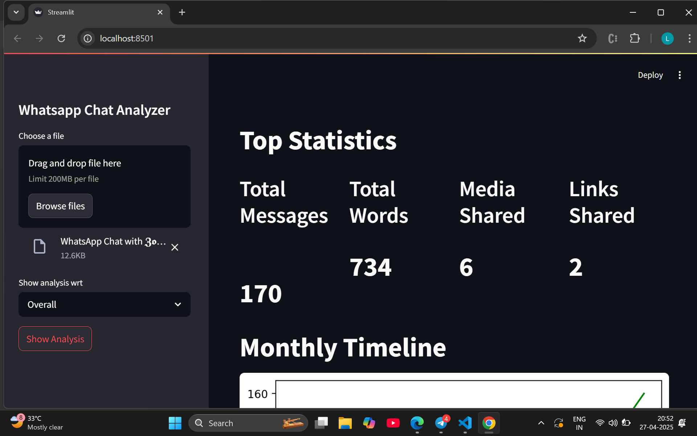
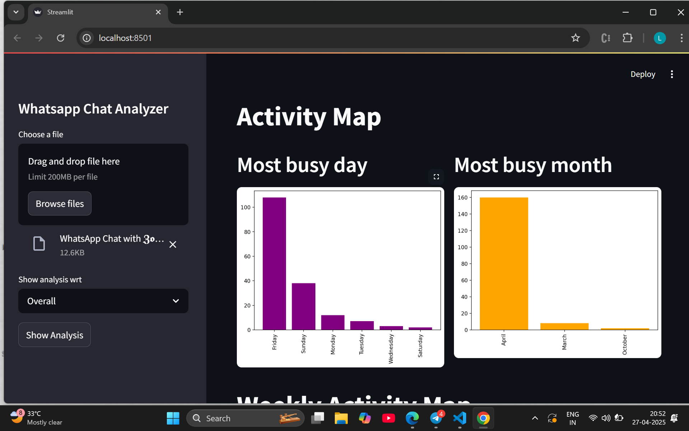
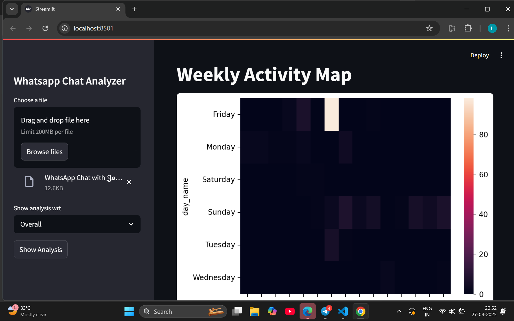
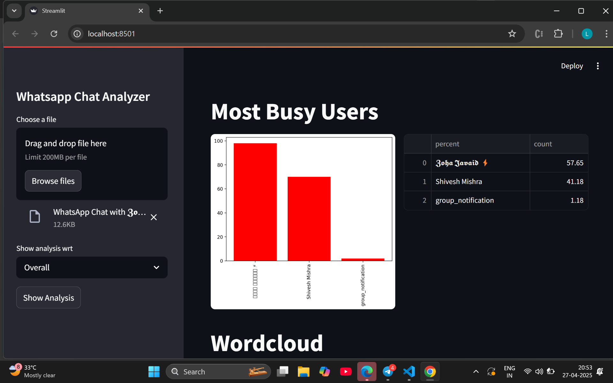
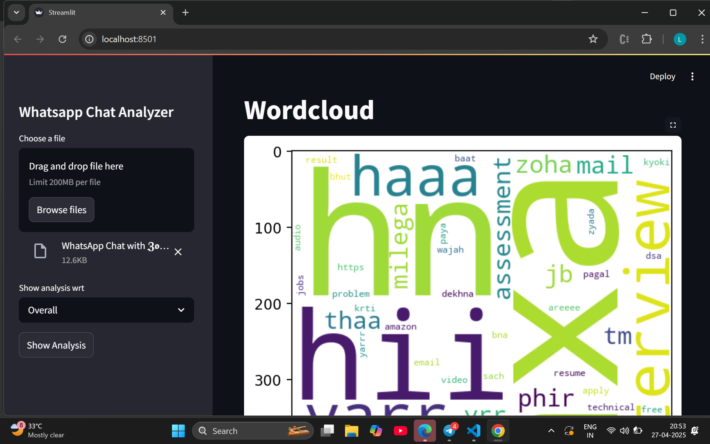
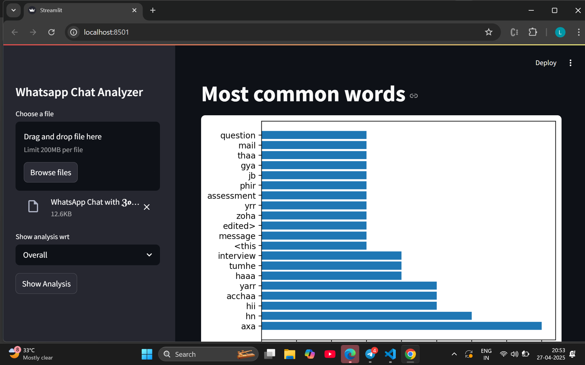
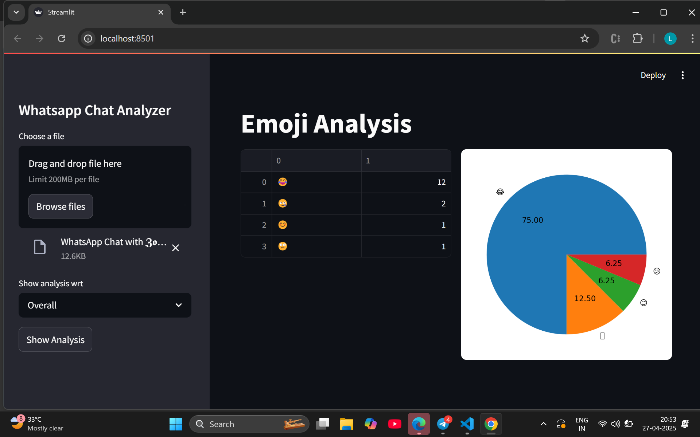

# whatsapp-chat-analysis
A streamlit app to analyze your whatsapp chats.

A streamlit app to analyze your whatsapp chats

This project analyzes WhatsApp chat exports to provide meaningful insights like message counts, media sharing, emoji usage, and more!

## Features ✨
- Upload and parse WhatsApp chat text files.
- Visualize message trends over time.
- Identify most active users and peak chatting hours.
- Emoji and word usage analysis.
- Media, link, and word statistics.

---

## How to Run 🚀
1. Clone the repository:
   ```bash
   git clone https://github.com/Laibanoor92/Whatsapp-chat-analysis.git
   ```
2. Install the required libraries:
   ```bash
   pip install -r requirements.txt
   ```
3. Run the app:
   ```bash
   streamlit run app.py
   ```

---

## Output Screenshots 📸

### Screenshot 1


### Screenshot 2


### Screenshot 3


### Screenshot 4


### Screenshot 5


### Screenshot 6


### Screenshot 7


---

## Tech Stack 🛠
- Python
- Streamlit
- Pandas
- Matplotlib / Seaborn

---

## Author 👩‍💻
- [Laiba Noor](https://github.com/Laibanoor92)

---

## License 📄
This project is open source and free to use under the [MIT License](LICENSE).